<h1>Image processing</h1>   

<h3>1. Add noise, calculate histogram, calculate information entropy of gray scale image.</h3>   

- Below images are result of `main.py`.(Lenna image is used here.)   
   
    **1. Noise**   
    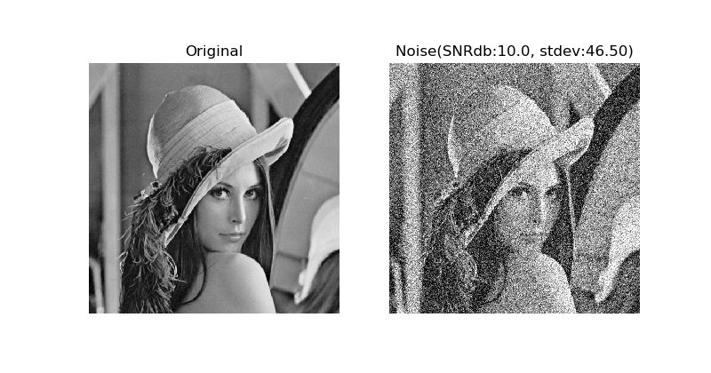  
    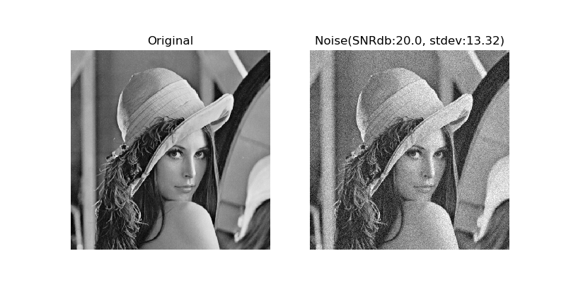  
    
   
    **2. histogram**   
    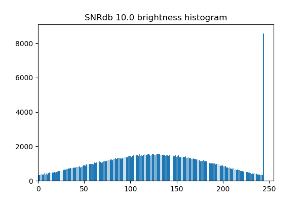  
    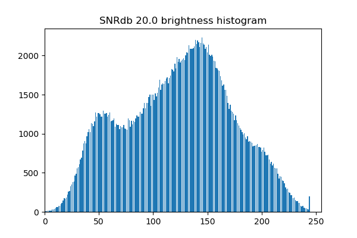  
    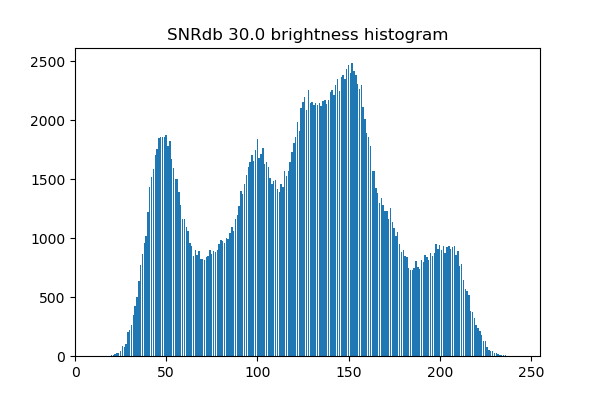

    **3. Information entropy**   
    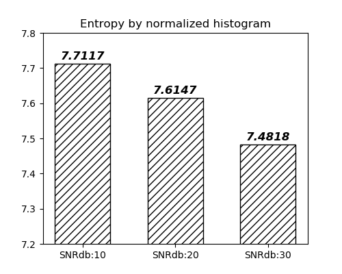    
 
 ---
 
<h3>2. Draw power spectrum of image (using DFT) </h3>   

- Below images are result of `main2.py`.

    **1. Target image**    
    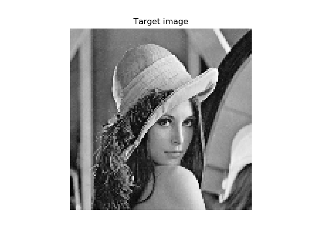
    
    **2. Power spectrum 2D**    
    * Not centered.
    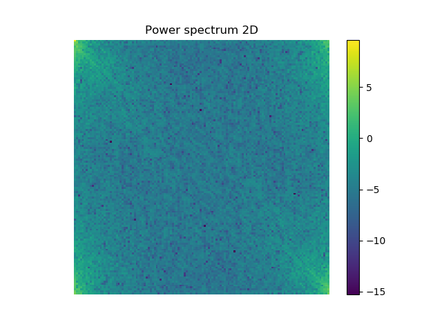   
    * Centered.
    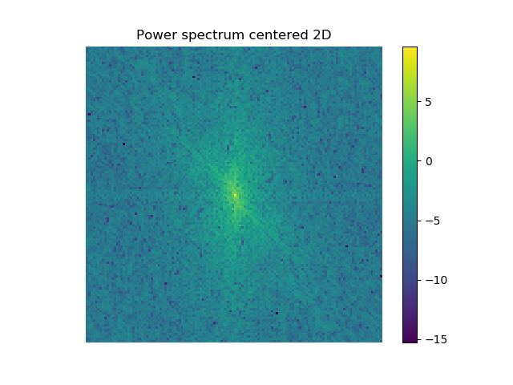    
    
    **3. Power spectrum 3D**    
    * Not centered.
    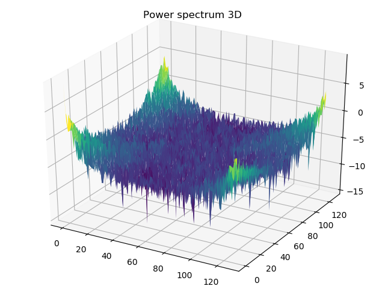   
    * Centered.
    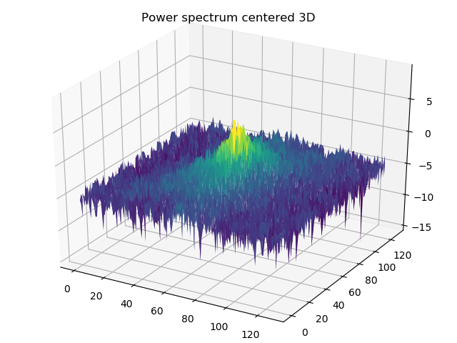    